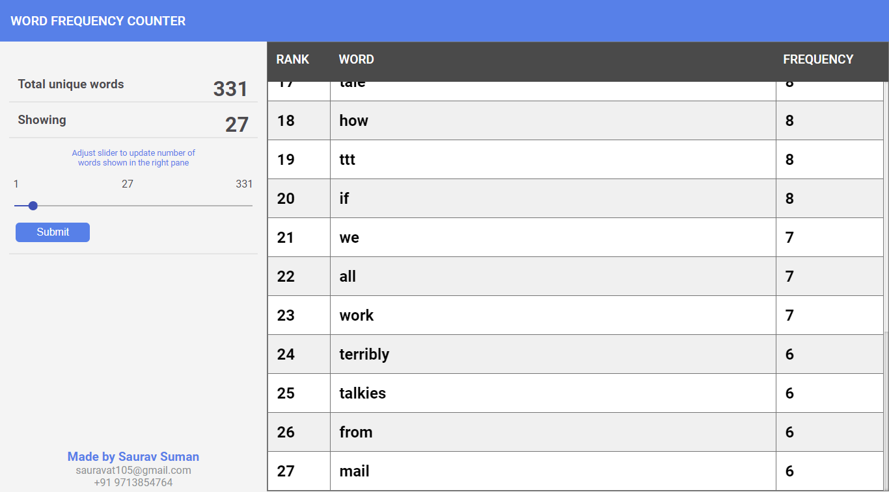

# WordFrequencyCounter

This project was generated with [Angular CLI](https://github.com/angular/angular-cli) version 7.2.1.

### [Demo](http://18.191.17.209/)

## Steps to run the application
* Clone the repo
* _run_ ` npm install`
* _run_ `npm run dev` to start the application in development mode

## Code Components
* Code has been divided into two parts - UI & backend which are written in Angular and Node JS respectively.
* `index.js` inside `/server` directory is the entry point for spinning the http server that serves angular using angular-cli, the usual `ng serve`  
  #### UI
+ Screen has a root component i.e. app-component that contains nav-component at the top with app title. Rest part of screen is divided into two part, the left one is for entering the input N where user can configure input N and click Submit, then the right part shows top N words with its frequency and rank in tabular format
+ Api calls are passed through a proxy-config as node js server starts on separate port
  #### Backend
+ This contains 2 essential js files, `/routes/file.route.js` containing api end points & `/routes/file.controller.js` containing business logics.
+ `/constant/constant.js` file contains uri for file, delimiters and regex for word detection  

## Libraries used
* Angular-material
* jquery
* express
* request
* cors

## Preview
